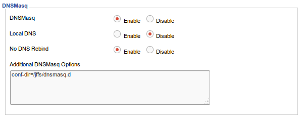

# Install DNSCrypt

DNSCrypt is a protocol that authenticates communications between a DNS client and a DNS resolver.

### Download dsncrypt-proxy
Download compiled binary dnscrypt-proxy for router from http://files.lancethepants.com/Binaries/dnscrypt-proxy/mipsel

Upload dnscrypt-proxy and dnscrypt-resolvers.csv to the router

### Choose a best dns resolver from the csv file
There are several encrypt DNS servers in the dnscrypt-resolvers.csv file, we need to select a fatest one.

### Added the startup cmd to the router
>/jffs/dnscrypt-proxy --local-address=127.0.0.1:1053 --ephemeral-keys --daemonize --resolvers-list=/jffs/dnscrypt-resolvers.csv --resolver-name=d0wn-sg-ns1 --logfile=/jffs/log/dnscrypt-proxy.log

**d0wn-sg-ns1** is the resolver name from the dnscrypt-resolvers.csv file

### Config the DNSMasq to use the dnscrypt-proxy
Upload the [dnsmasq.conf](dnsmasq/dnsmasq.conf) to the router

Go to the router's control panel http://192.168.1.1

Services > Services > DNSMasq 

Add the following option:
>conf-dir=/jffs/dnsmasq.d

